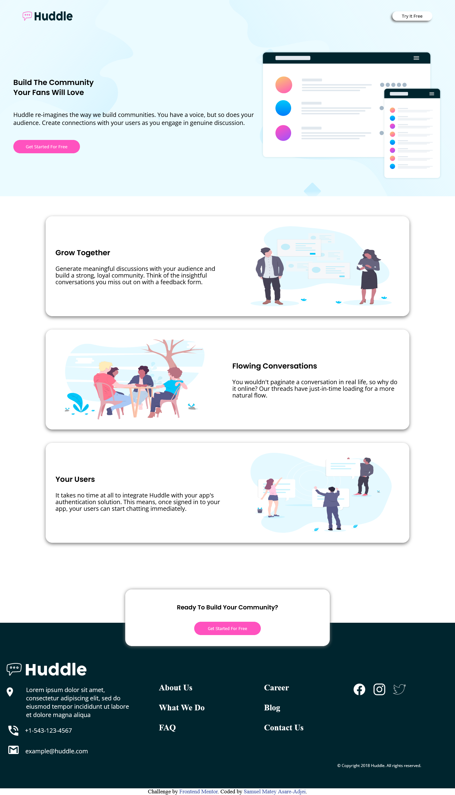
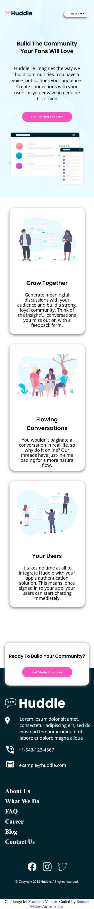

# Frontend Mentor - Huddle landing page with alternating feature blocks solution

This is a solution to the [Huddle landing page with alternating feature blocks challenge on Frontend Mentor](https://www.frontendmentor.io/challenges/huddle-landing-page-with-alternating-feature-blocks-5ca5f5981e82137ec91a5100). Frontend Mentor challenges help you improve your coding skills by building realistic projects. 

## Table of contents

- [Overview](#overview)
  - [The challenge](#the-challenge)
  - [Screenshot](#screenshot)
  - [Links](#links)
- [My process](#my-process)
  - [Built with](#built-with)
  - [What I learned](#what-i-learned)
  - [Continued development](#continued-development)
  - [Useful resources](#useful-resources)
- [Author](#author)


**Note: Delete this note and update the table of contents based on what sections you keep.**

## Overview

### The challenge

Users should be able to:

- View the optimal layout for the site depending on their device's screen size
- See hover states for all interactive elements on the page

### Screenshot





### Links

- Solution URL: [Add solution URL here](https://your-solution-url.com)
- Live Site URL: [Huddle-landing-page](https://sam-mantey.github.io/Huddle-Landing-Page/)

## My process

### Built with

- Semantic HTML5 markup
- CSS custom properties
- Flexbox
- CSS Grid
- Mobile-first workflow

### What I learned

I learnt how to make two div overlap eachother.
```html
 <div class="bottom">
    <div class="ready">
      <h4>Ready To Build Your Community?</h4>
      <button>
        Get Started For Free
      </button>
    </div>
  </div>
```
```css
.ready {
    display: block;
    margin-top: -100px;
}
```
The code above makes the ".ready" div overlap the ".bottom" div.


### Continued development

In my next projects i would want to add javascript and javascript libraries like react to make my webpages and websites more interactive.

### Useful resources

- [How to overlap a div over another](https://youtu.be/_HTL0XSMcRQ) - This helped me for XYZ reason. I really liked this pattern and will use it going forward.


## Author

- Frontend Mentor - [@sam-mantey](https://www.frontendmentor.io/profile/yourusername)
- Twitter - [@sam_mantey](https://www.twitter.com/yourusername)
